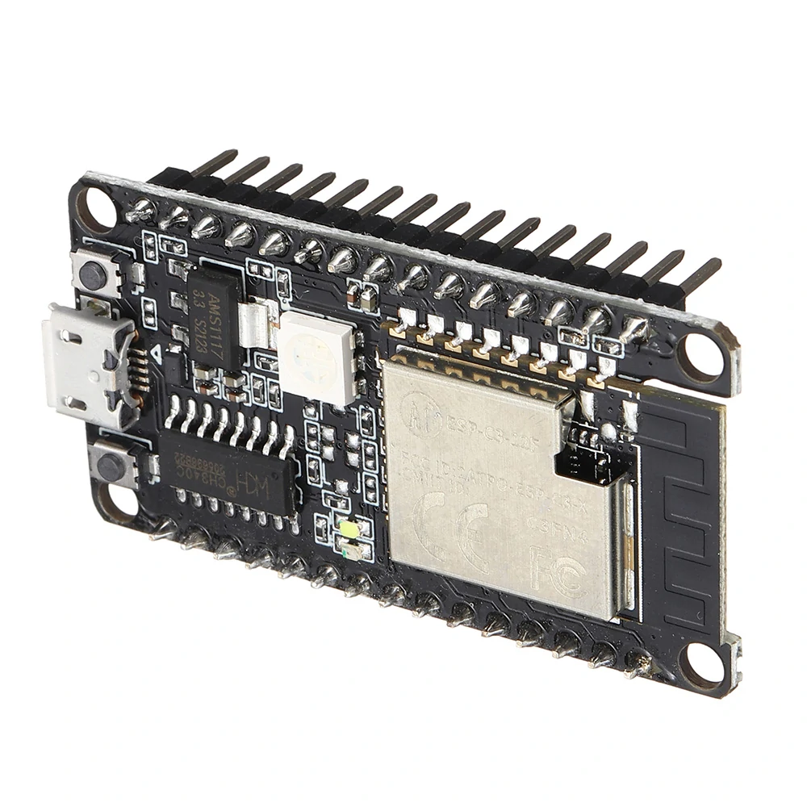
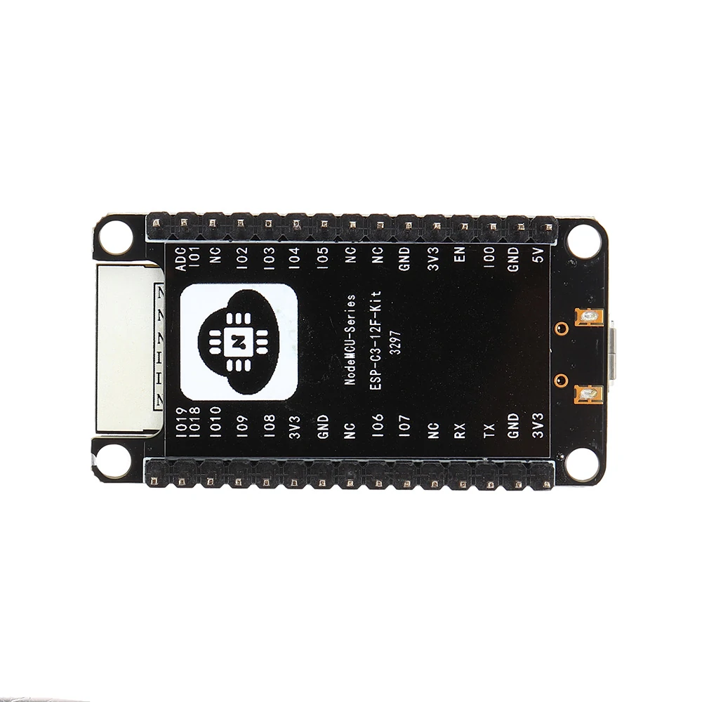

# Ai-Thinker ESP-C3-12F-Kit Series Development Board

## Description

The ESP-C3-12F-Kit development board is a core development board designed by ESP-C3-12F for the ESP-C3-12F module. The development board continues the classic design of the NodeMCU development board, leading all I/O to the With pin headers, developers can connect peripherals according to their needs. When using the breadboard for development and debugging, the standard headers on both sides can make the operation easier and more convenient.

## Features

- Support Wi-Fi 802.11b/g/n, 1T1R mode data rate up to 150Mbps
- Support BLE5.0, does not support classic Bluetooth, rate support: 125Kbps, 500Kbps, 1Mbps, 2Mbps
- RISC-V 32-bit single-core processor, supports a clock frequency of up to 160 MHz, has 400 KB SRAM, 384 KB ROM, 8KB RTC SRAM
- Support UART/PWM/GPIO/ADC/I2C/I2S interface, support temperature sensor, pulse counter
- The development board has RGB three-in-one lamp beads, which is convenient for the second development of customers
- Support multiple sleep modes, deep sleep current is less than 5u
- Serial port rate up to 5Mbps
- Support STA/AP/STA+AP mode and promiscuous mode
- Support Smart Config (APP)/AirKiss (WeChat) of Android and IOS, one-click network configuration
- Support serial port local upgrade and remote firmware upgrade (FOTA)
- General AT commands can be used quickly
- Support secondary development, integrated Windows and Linux development environment
- About Flash configuration ESP-C3-12F uses the built-in 4MByte Flash of the chip by default, and supports the external Flash version of the chip.





Source: [ESP32-C3 series module](https://docs.ai-thinker.com/en/esp32c3)

## Setup MicroPython

Flashing [ESP32-C3](https://micropython.org/download/ESP32_GENERIC_C3/)

```bash
esptool.py --chip esp32c3 --port /dev/tty.usbserial-110 erase_flash

esptool.py --chip esp32c3 --port /dev/tty.usbserial-110 --baud 460800 write_flash -z 0x0 ESP32_GENERIC_C3-20240222-v1.22.2.bin
```

If the above commands run without error then MicroPython should be installed on your board!

```bash
# MicroPython REPL
screen /dev/tty.usbserial-110 115200

# End screen session from other terminal window
screen -ls # list all screen sessions
screen -XS 4581 quit # kill a screen sessions
