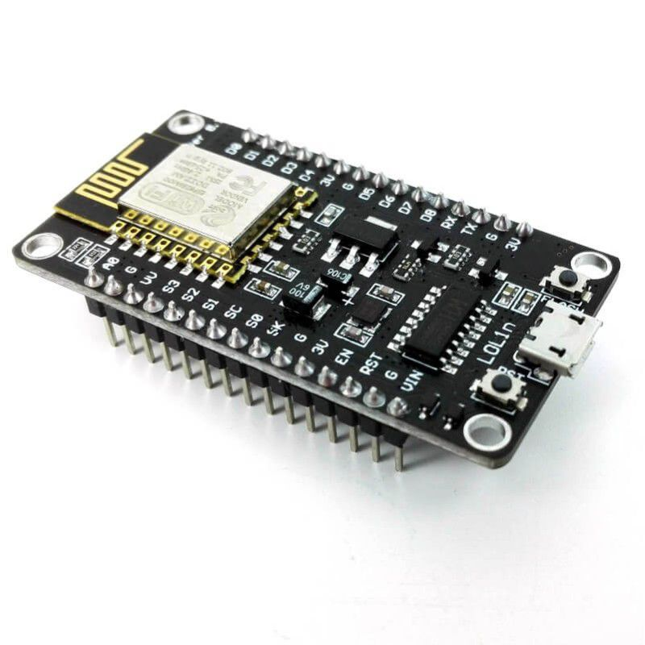
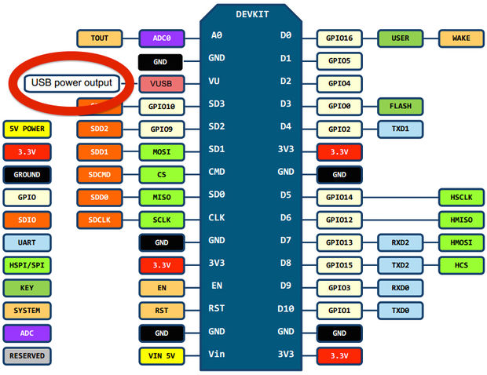
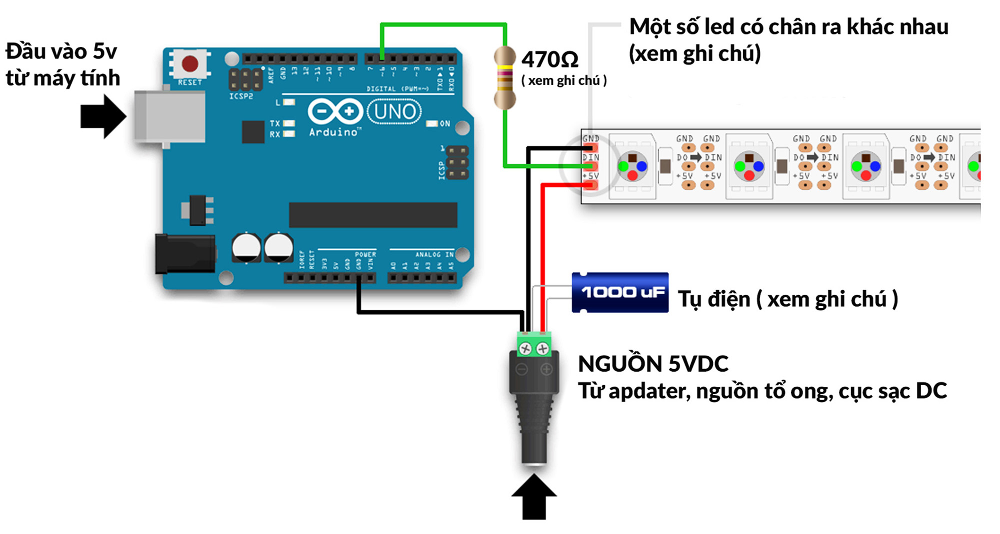

# ESP8266 NodeMCU Lua V3 CH340 LoLin wemos.cc

Đây chính là NodeMCU nổi tiếng xây dựng trên nền SoC ESP8266 WiFi . Đây là phiên bản thứ 3 và nó dựa trên ESP-12E (một module WiFi ESP8266). NodeMCU cũng là một bộ mã nguồn mở (opensource) và bộ kit phát triển giúp bạn xây dựng các ứng dụng IoT với ngôn ngữ lập trình LUA, hoặc sử dụng nó với Arduino IDE.

Source: [ESP8266 NodeMCU Lua V3 CH340 LoLin](https://www.cytrontech.vn/p-nodemcu-lua-v3-esp8266-wifi-with-ch340c)

[Neopixel wiring](https://nshopvn.com/product/led-day-ws2812-phu-epoxy-5vdc-1m-144-bong/)
